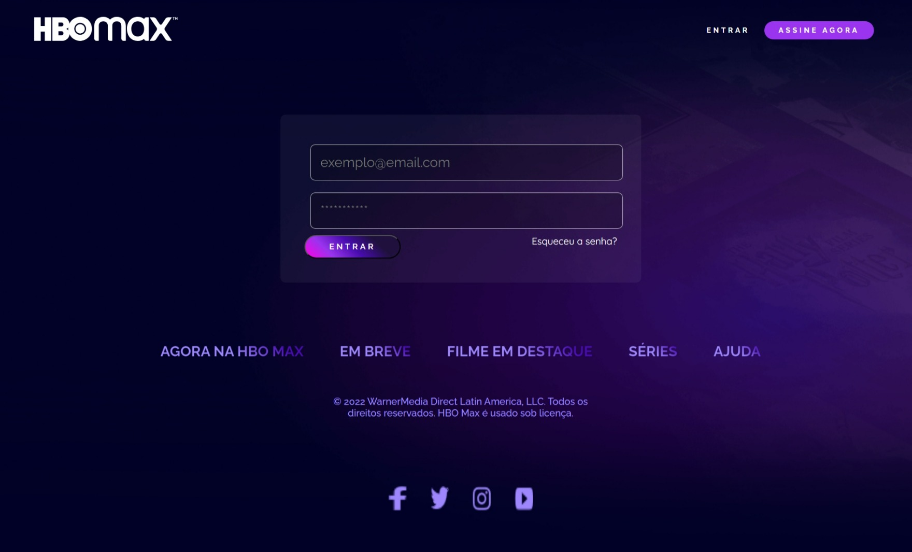

<h1 align="center">Desafio CSS - HBO Max - <a href="https://dio.me/"> DIO (Digital Inovation One)</a></h1>

  O clone do site HBO Max serve como desafio para os alunos da plataforma testarem seus conhecimentos e colocarem em prática os recursos de HTML e CSS abordados durante os cursos.

<h2 id="features">✨ Features</h2>

> Menu de navegação./
> Cabeçalho com animação gradiente./
> Cards com os planos de assinatura animados./
> Lista de filmes e séries disponíveis na plataforma./
> Formulário de login./
> Rodapé com links importantes./
> UI Responsiva

*As features são visuais, não possuindo integração com nenhuma API. O intuito do projeto é reproduzir a interface do site original, com algumas modificações.*

<h2 id="topics">📦 Temas abordados</h2>

O projeto possui como intuito aplicar os conceitos abordados na Trilha de CSS da <a href="https://dio.me">DIO</a>, ministrada pela instrutora <a href="https://github.com/micheleambrosio">Michele Ambrosio</a>.

Recursos CSS presentes no projeto:

- Fundamentos do CSS
- Grid Layout
- Flexbox
- Responsividade
- Pseudo-elementos
- Pseudo-classes
- Transformações 2D e 3D
- Transições e animações
- Tratamento de campos inválidos no formulário

<h2 id="author">💻 Autor(a)</h2>

    
    
&nbsp&nbsp&nbspMichele Queiroz Ambrosio 
    &nbsp&nbsp&nbsp<a href="http://instagram.com/programi_">Instagram</a>&nbsp;|&nbsp;<a href="https://github.com/micheleambrosio">GitHub</a>&nbsp;|&nbsp;<a href="https://www.linkedin.com/in/michele-ambrosio-a4899661/">LinkedIn</a>&nbsp;|&nbsp;<a href="https://www.twitch.tv/michele_ambrosio">Twitch</a>

  
<h2>PRINT DO PROJETO FINALIZADO: Página index.html.</h2>

<h2>PRINT DO PROJETO FINALIZADO: Página signIn.html.</h2>

